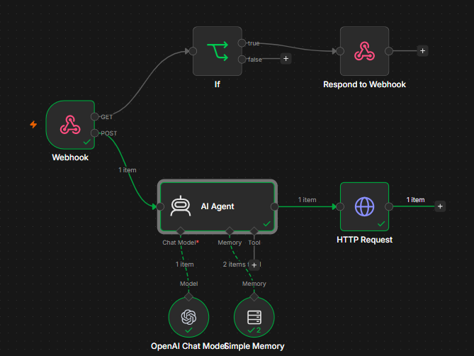
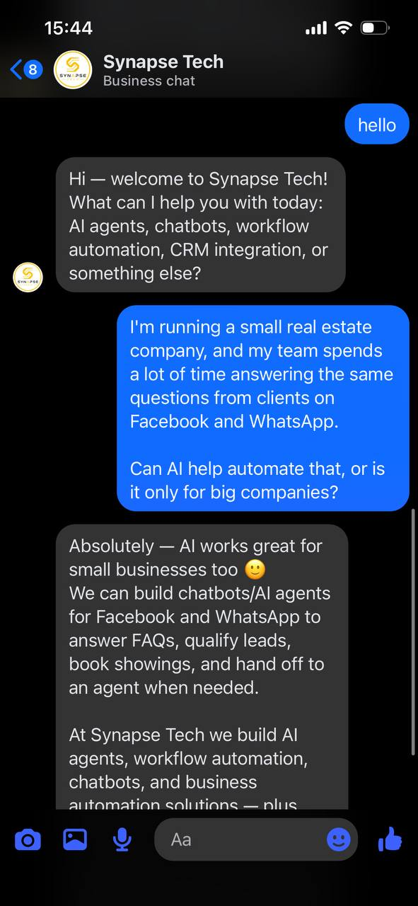

# AI Facebook Messenger Chatbot

An AI-powered customer support chatbot built with **n8n**, **OpenAI**, and the **Meta Graph API**. The workflow receives customer messages from Facebook Messenger, generates context-aware AI responses, and automatically sends replies back to users.

---

## Features

- 🤖 AI-powered customer support
- 💬 Context-aware conversation handling
- 📩 Automatic Facebook Messenger replies
- ⚡ Real-time message processing
- 🔗 OpenAI API integration
- 🌐 Meta Graph API integration
- 🔄 Fully automated n8n workflow

---

## Technologies

- n8n
- OpenAI API
- Meta Graph API
- Facebook Messenger Platform
- HTTP Requests
- JSON

---

## Workflow

The chatbot follows this process:

1. Receive an incoming Facebook Messenger message.
2. Extract and prepare the customer's message.
3. Generate a context-aware response using OpenAI.
4. Send the generated reply back through Facebook Messenger.
5. Complete the workflow automatically.

### Workflow Diagram



---

## Chatbot Example

Example of the chatbot responding to customer messages through Facebook Messenger.



---

## Repository Structure

```text
.
├── Facebook Messenger Chatbot.json
├── workflow.png
├── messenger_chat.jpg
└── README.md
```

---

## Use Cases

- Customer support
- Frequently asked questions
- Product inquiries
- Business information
- Appointment booking
- Lead qualification

---

## Future Improvements

- Conversation memory
- Human agent handoff
- CRM integration
- Multi-language support
- Customer profile management
- Order tracking integration

---


